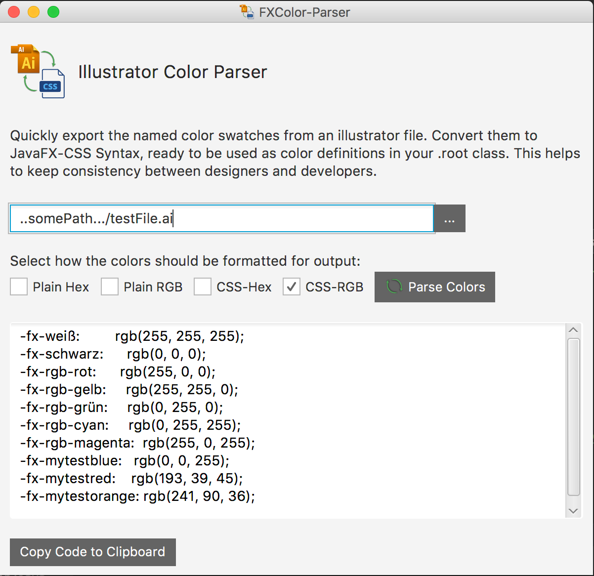

#  Illustrator to CSS Color Parser
This small tool parses named color swatches from Adobe Illustrator (.ai) files and converts them into css syntax variables.
It is a standalone JavaFX Application, a prebuilt jar can be found as well as the code. Illustrator files are binary, however they have a section that is xml-based and all of the color swatches defined in a document are stored in the xml header and can thus be extracted using regex. The tool was built to speed up the "translation" of styleguides for larger applications into css code. Manually reading out and copying tens or even hundreds of color values from .ai files into css is really cumbersome and annoying, so this hopefully saves some time.

>:exclamation: Currently the tool only supports RGB-based .ai files! CMYK colors will not be detected!

>:information_source: A sample .ai testFile with some named color swatches is included in the repo [here](testFile.ai)

## Variants
The core functionality of parsing the color names and values from the Illustrator files was packaged in two different ways, both of which can be found in this repo:

* [A standalone JavaFX-based App](/StandaloneApp)
* [An IntelliJPlugin](/IntelliJPlugin) that enables automatic import of the colors via right click in the editor

The user interface of the standalone application:

